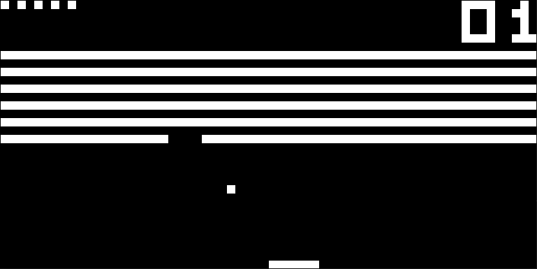

# Emu8: A Chip-8 emulator

An 8-bit chip emulator written in C, using the SDL2 library.


## Installation

You need to have installed the SDL2 library.

In Debian/Ubuntu systems you can use ```apt``` to install it.

```bash
sudo apt install libsdl2-dev
```

## Usage

First compile the source code with ```make```.

```bash
make build 
```

Then you can run it like this, providing the path to a ```.ch8``` rom.

```bash
./emu8 path_to_the_rom
```

## Controls

```
ESC: exit the program
SPACE: pauses the execution of the program

1 | 2 | 3 | 4
Q | W | E | R
A | S | D | F
Z | X | C | V
```

## Resources

https://tobiasvl.github.io/blog/write-a-chip-8-emulator/ 

## Other images



